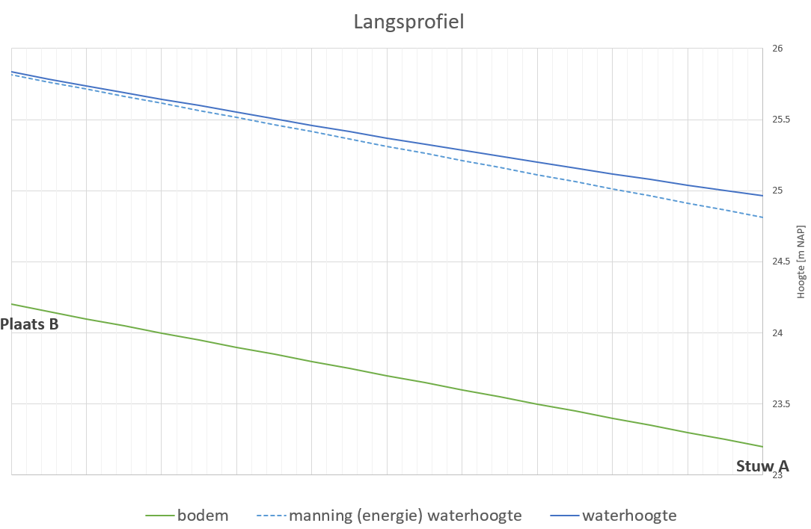
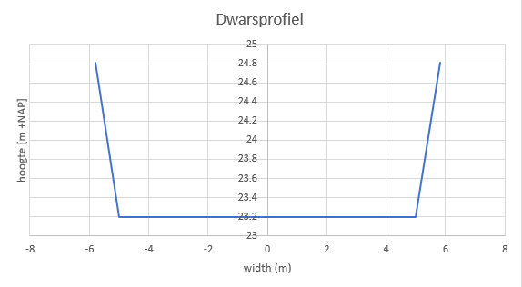
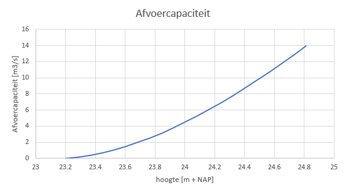

# ontwerptool

Ontwerptool voor waterlopen

Een eenvoudige tool om in gestuwde gebieden op basis van stationaire (niet variabel over tijd) een waterspiegelverhang te berekenen.

## Manning Afvoer
Met de [manning formule](https://en.wikipedia.org/wiki/Manning_formula) berekenen we de afvoercapaciteit van een kanaal onder stationair uniforme condities. Dit betekent:
- Stationair: afvoer verandert niet over tijd
- Uniform: het profiel verandert niet in de langs-richting van de waterloop

Dit betekent ook dat het bodemverhang gelijk is aan het waterspiegelverhang

## Stuwkromme
Op basis van de [stuw formule](https://learn.hydrologystudio.com/studio-express/knowledge-base/weirs/) kan de hydraulische straal worden berekend over een stuw. Deze hydraulische straal + de kruinhoogte bepaalt de waterhoogte direct bovenstrooms de stuw. Deze waterhoogte is niet gelijk, meestal hoger, dan de waterhoogte volgens de manningafvoer (= energiehoogte).

Met de [Standaard Step Method (STM)](https://en.wikipedia.org/wiki/Standard_step_method) berekenen we de stuwkromme op basis van [Gradually Varied Flow](https://ocw.mit.edu/courses/1-060-engineering-mechanics-ii-spring-2006/fcd9766c90f5a533de96c18c587dd706_lecture30.pdf)

## Beperkingen
Deze methode werkt prima voor het inschatten van stuw en profiel-dimensies voor kanalen die min-of-meer voldoen aan de geldigheids-criteria voor de manning formule en gestuwd zijn door 1 kunstwerk. Dus niet voor:
- vermaasde netwerken
- (snel) veranderende waterloopprofielen en verhanglijnen
- variabele afvoer in tijd
- laterale instroom